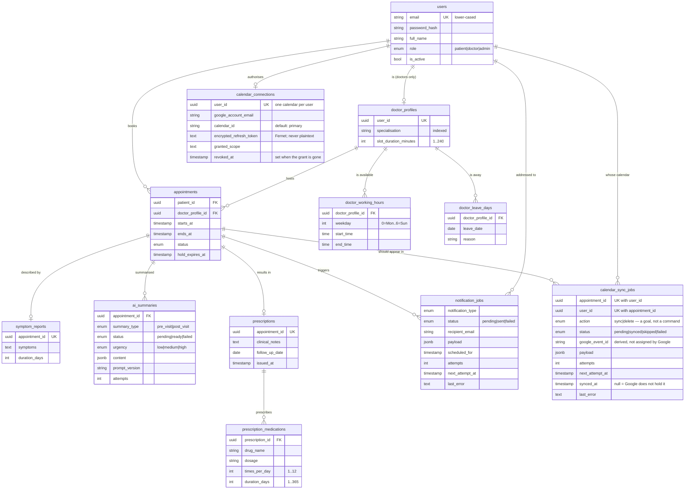

# Data model

Twelve tables. The first ten come from a single migration (`df66272d6310`); the two
calendar tables were added in `6db78daa0931`. Every table has a UUID primary
key generated by the database and `created_at` / `updated_at` timestamps, both maintained
server-side; those columns are omitted below to keep the diagram readable.



## The constraints that carry the design

The schema is not just storage here — several requirements are enforced by the database
itself rather than by application code that could be bypassed or get it wrong.

### Double booking is impossible at the storage layer

```sql
CREATE UNIQUE INDEX uq_appointments_doctor_occupied_slot
    ON appointments (doctor_profile_id, starts_at)
    WHERE status IN ('held', 'confirmed', 'completed');
```

The index is **partial** on purpose. Constraining every row would mean a cancelled
appointment permanently blocked its slot; constraining only occupying statuses means a
cancellation frees the time immediately, with no cleanup step. Phase 3's booking service
adds row locking on top, but this index is the guarantee that holds even if that logic is
wrong. Verified directly in `tests/test_schema_constraints.py`.

### A hold can never be permanent

```sql
CHECK (status <> 'held' OR hold_expires_at IS NOT NULL)
```

A `held` row with no expiry would reserve a slot forever, and no availability query could
tell it apart from a real booking. The database refuses to store one.

### Other invariants enforced in the schema

| Constraint | Prevents |
| --- | --- |
| `ends_at > starts_at` | An appointment that ends before it begins |
| `end_time > start_time` on working hours | A working window that runs backwards |
| `weekday BETWEEN 0 AND 6` | A shift on the eighth day of the week |
| `slot_duration_minutes` between 1 and 240 | Zero-length or absurd slot lengths |
| Unique `(doctor_profile_id, leave_date)` | The same leave day recorded twice |
| Unique `(appointment_id, summary_type)` | Two competing pre-visit summaries |
| `status <> 'ready' OR content IS NOT NULL` | A summary marked ready with nothing in it |
| `status <> 'sent' OR sent_at IS NOT NULL` | A notification marked sent with no send time |
| `times_per_day` 1–12, `duration_days` 1–365 | Medication schedules that would spam a patient forever |
| Unique `user_id` on `calendar_connections` | Two calendars for one user, leaving "which one do we write to" undefined |
| Unique `(appointment_id, user_id)` on `calendar_sync_jobs` | More than one desired state for one calendar — the constraint the reconciler design rests on |

## Notes on specific choices

**UUID primary keys.** Appointment and prescription ids appear in URLs, email links and
calendar payloads. Sequential integers would let one patient reach another patient's records
by editing a number.

**Users in one table, not three.** Authentication, deactivation and notification addressing
are identical for all three roles. Role-specific data lives in `doctor_profiles` rather than
as columns that would be null for every patient.

**Deactivation instead of deletion.** `is_active` exists because appointments and
prescriptions must stay attributable after someone leaves the clinic. The foreign keys from
`appointments` use `ON DELETE RESTRICT` to make accidental erasure of clinical history fail
loudly.

**Structured medications.** `times_per_day` and `duration_days` are real columns because
Phase 6 schedules medication reminders from them. A reminder schedule must never depend on
parsing an LLM's prose — the model writes the patient's explanation, the structured fields
drive the alarms.

**Symptoms kept separate and verbatim.** `symptom_reports` holds what the patient actually
wrote, independent of whatever the model later made of it. It is also untrusted input, which
matters when it is fed to an LLM in Phase 6.

**`payload` on notification jobs is denormalised.** A queued message carries everything its
template needs, so rendering an email cannot depend on rows that may have changed — or been
cancelled — between queueing and sending.
